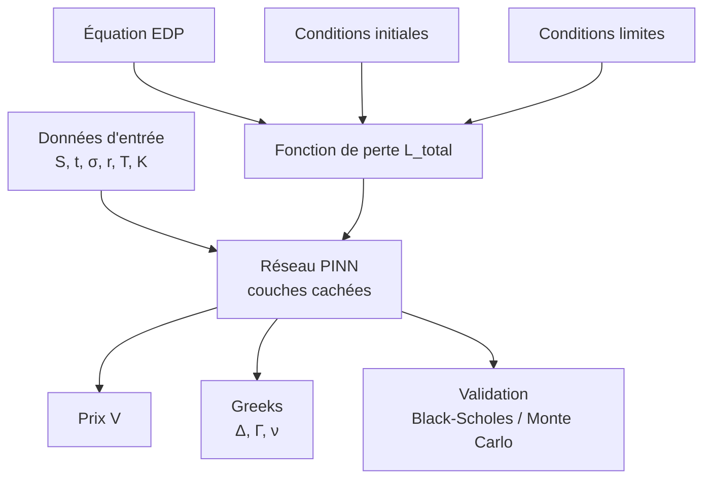

# NeuroPrice — Physics-Informed Neural Networks pour le Pricing Financier

## Document de Référence Complet · Projet Ingénieur MAM · Polytech Lyon

---

> **Statut** : Pré-développement  
> **Version** : 1.0.0  
> **Auteur** : M. BELLO — Ingénieur MAM, Polytech Lyon  
> **Ambition** : Produit SaaS / Web App commercialisable  
> **Horizon** : 12–18 mois  

---

## TABLE DES MATIÈRES

1. [Contexte & Genèse du Projet](#1-contexte--genèse-du-projet)
2. [Problématique](#2-problématique)
3. [Défis Scientifiques & Techniques](#3-défis-scientifiques--techniques)
4. [Objectifs du Projet](#4-objectifs-du-projet)
5. [État de l'Art & Positionnement](#5-état-de-lart--positionnement)
6. [Vision Produit](#6-vision-produit)
7. [Cahier des Charges Fonctionnel](#7-cahier-des-charges-fonctionnel)
8. [Architecture Technique](#8-architecture-technique)
9. [Fondations — Ce qu'il faut apprendre](#9-fondations--ce-quil-faut-apprendre)
10. [Roadmap de Développement](#10-roadmap-de-développement)
11. [Plan de Commercialisation SaaS](#11-plan-de-commercialisation-saas)
12. [Ressources & Bibliographie](#12-ressources--bibliographie)

---

## 1. CONTEXTE & GENÈSE DU PROJET

### 1.1 Le Monde du Pricing Financier

La valorisation d'instruments financiers dérivés — options, produits structurés, contrats futures — est au cœur de la finance de marché mondiale. Chaque jour, des milliards d'euros de contrats sont pricés, échangés, couverts sur les marchés mondiaux.

Pricer un instrument financier, c'est répondre à une question fondamentale :

> *"Quelle est la juste valeur aujourd'hui d'un contrat dont le payoff dépend d'un événement futur incertain ?"*

Pour répondre à cette question, les quants (mathématiciens de la finance) ont développé depuis les années 1970 des modèles mathématiques sophistiqués, dont le plus célèbre est le modèle de **Black-Scholes-Merton** (Prix Nobel d'Économie 1997).

### 1.2 Le Verrou Mathématique Actuel

Ces modèles de pricing se formulent naturellement comme des **équations aux dérivées partielles (EDPs)**. Le modèle de Black-Scholes donne naissance à l'EDP :

```math
\frac{\partial V}{\partial t}
+\frac{1}{2}\sigma^{2} S^{2}\frac{\partial^{2} V}{\partial S^{2}}
+ r S \frac{\partial V}{\partial S}
- rV = 0.
```

Pour les options européennes simples, cette EDP possède une solution analytique fermée (la formule de Black-Scholes). Mais dans la réalité des marchés, les praticiens ont besoin de pricer des instruments bien plus complexes :

- **Options exotiques** : barrières, lookback, asiatiques, digitales...
- **Modèles de volatilité avancés** : volatilité locale (Dupire), volatilité stochastique (Heston, SABR)
- **Instruments multi-sous-jacents** : options sur panier, produits de corrélation
- **Dérivés de taux d'intérêt** : swaps, caps, floors, swaptions

Pour ces instruments, **il n'existe pas de formule analytique**. Les banques et hedge funds utilisent alors deux approches classiques :

**Méthode 1 — Monte Carlo** : simuler des milliers/millions de trajectoires stochastiques et moyenner les payoffs. Précis mais extrêmement lent (minutes à heures pour les produits complexes).

**Méthode 2 — Différences Finies (FDM)** : discrétiser l'EDP sur une grille et résoudre numériquement. Plus rapide mais limité à des dimensions basses (malédiction de la dimensionnalité au-delà de 3-4 sous-jacents).

### 1.3 L'Émergence des Physics-Informed Neural Networks

En 2019, une publication scientifique majeure de **Raissi, Perdikaris & Karniadakis** (MIT/Brown University) publiée dans le *Journal of Computational Physics* révolutionne l'approche : les **Physics-Informed Neural Networks (PINNs)**.

L'idée fondamentale est élégante :

> Au lieu de discrétiser une EDP sur une grille, on entraîne un réseau de neurones à satisfaire simultanément l'EDP ET les conditions aux limites, en intégrant les lois physiques directement dans la fonction de perte.

Cette approche a d'abord été développée pour la mécanique des fluides, la physique des matériaux, et l'ingénierie. Son application à la **finance quantitative** est un domaine de recherche émergent, avec des premiers résultats publiés depuis 2020-2022.

### 1.4 Le Gap du Marché

Aujourd'hui, en 2025-2026 :

- Les **banques** et **hedge funds** top-tier (Goldman Sachs, Citadel, Two Sigma) explorent les PINNs en interne, en R&D confidentielle
- Il n'existe **aucune plateforme commerciale** accessible offrant du pricing financier par PINN
- Les **PME financières, FinTechs, family offices, trésoreries d'entreprises** n'ont pas accès à ces technologies de pointe
- Les **outils disponibles** (QuantLib, Bloomberg) utilisent encore des méthodes numériques classiques des années 1990-2000

**C'est précisément ce gap que ce projet adresse.**

---

## 2. PROBLÉMATIQUE

### 2.1 Formulation du Problème

**Comment résoudre efficacement des EDPs financières complexes — notamment dans des espaces de haute dimension — en exploitant la puissance des réseaux de neurones informés par la physique, et rendre cette technologie accessible via une interface web démocratisant le pricing quantitatif avancé ?**

### 2.2 Décomposition de la Problématique

**Problème mathématique :**
Les EDPs financières en haute dimension (N sous-jacents, avec N > 3) sont insolubles par les méthodes numériques classiques en temps raisonnable — c'est la *curse of dimensionality*. Un réseau de neurones est, par nature, une approximation de fonction en haute dimension.

**Problème numérique :**
Les méthodes de différences finies et de Monte Carlo offrent un compromis précision/vitesse défavorable pour les instruments exotiques. Peut-on entraîner un PINN *une seule fois* pour un modèle donné, puis faire de l'inférence quasi-instantanée ?

**Problème d'accès :**
Les outils de pricing quantitatif avancés coûtent des centaines de milliers d'euros (licences Bloomberg, systèmes propriétaires). Peut-on démocratiser ce pricing via une API / SaaS ?

**Problème d'interprétabilité :**
En finance réglementée (IFRS 13, FRTB), les modèles doivent être explicables. Les PINNs peuvent-ils fournir non seulement des prix, mais aussi des Greeks (sensibilités) par auto-différentiation, et une explication du modèle ?

---

## 3. DÉFIS SCIENTIFIQUES & TECHNIQUES

### 3.1 Défi 1 — Formuler l'EDP comme problème d'optimisation

**Description :** Un PINN résout une EDP en minimisant une fonction de perte composite :

```
L_total = L_EDP + λ₁·L_CI + λ₂·L_CL
```

Où :
- `L_EDP` : résidu de l'équation différentielle sur des points de collocation intérieurs
- `L_CI` : erreur sur les conditions initiales (payoff à maturité)
- `L_CL` : erreur sur les conditions aux limites (comportement aux frontières du domaine)

**Défi :** Choisir les bons points de collocation, équilibrer les termes de la loss, et s'assurer de la convergence vers la bonne solution.

**Lien MAM :** C'est exactement la formulation variationnelle / méthode de Galerkin que tu étudies en éléments finis — mais ici, les fonctions de base sont les couches du réseau de neurones.

### 3.2 Défi 2 — Maîtriser la malédiction de la dimensionnalité

**Description :** Pour une option sur un panier de 10 actifs, l'EDP vit dans un espace à 10 dimensions. Une grille de différences finies avec 100 points par dimension nécessiterait 100¹⁰ = 10²⁰ points — computationnellement impossible.

**Défi :** Un PINN échantillonne des points de collocation aléatoirement dans l'espace de haute dimension (méthode de Monte Carlo en quelque sorte), permettant théoriquement d'attaquer des dimensions élevées.

**Verrou actuel :** L'entraînement devient difficile en très haute dimension. Des architectures spécialisées (attention mechanisms, factorized networks) sont nécessaires.

### 3.3 Défi 3 — Auto-différentiation pour les Greeks

**Description :** Les Greeks (Delta, Gamma, Vega...) sont les dérivées partielles du prix par rapport aux paramètres. Dans un PINN, ces dérivées sont calculées **exactement** par rétropropagation (automatic differentiation) — pas par différences finies approchées.

**Avantage :** Les Greeks obtenus sont plus précis et cohérents que par différences finies. C'est un avantage majeur du PINN sur les méthodes classiques.

**Défi :** Assurer la stabilité numérique des dérivées d'ordre 2 (Gamma) et plus.

### 3.4 Défi 4 — Calibration et généralisation

**Description :** Un PINN classique est entraîné pour des paramètres fixes (σ, r, T donnés). En pratique, un trader veut pricer pour *n'importe quelle* combinaison de paramètres en temps réel.

**Innovation clé du projet :** Entraîner un **PINN paramétrique** qui prend en entrée non seulement (S, t) mais aussi (σ, r, T, K) — et donne directement le prix. Une fois entraîné, ce réseau est un *universal pricer* pour la classe d'instruments considérée.

### 3.5 Défi 5 — Validation et confiance du modèle

**Description :** En finance, un modèle doit être validé rigoureusement avant tout usage opérationnel. Il faut :
- Comparer aux solutions analytiques connues (Black-Scholes pour les cas simples)
- Comparer aux méthodes numériques de référence (Monte Carlo précis)
- Mesurer l'incertitude des prédictions (Bayesian PINNs)
- Tester la robustesse aux paramètres extrêmes

---

## 4. OBJECTIFS DU PROJET

### 4.1 Objectifs Scientifiques

**OS1 — Implémenter un PINN de base pour l'équation Black-Scholes 1D**
Résoudre l'EDP Black-Scholes pour une option européenne et valider contre la formule analytique avec une erreur relative < 0.5%.

**OS2 — Étendre aux options exotiques sans solution analytique**
Pricer options barrières, asiatiques et lookback par PINN et valider par Monte Carlo haute précision.

**OS3 — Construire un PINN paramétrique (universal pricer)**
Entraîner un réseau prenant (S, t, σ, r, T, K) en entrée et donnant V(S,t;σ,r,T,K) — permettant l'inférence en temps réel pour tout jeu de paramètres.

**OS4 — Calculer les Greeks par auto-différentiation**
Extraire Δ, Γ, ν, Θ, ρ directement du réseau entraîné et comparer à la référence analytique.

**OS5 — Attaquer la haute dimension (bonus)**
Adapter l'architecture pour pricer des options sur panier (2-5 actifs) — là où les méthodes classiques échouent.

### 4.2 Objectifs Techniques

**OT1 — Pipeline ML complet** : data generation → training → validation → inference → API

**OT2 — Performance** : inférence < 10ms pour un prix unique après entraînement

**OT3 — Interface web** : dashboard interactif accessible sans expertise technique

**OT4 — API REST** : endpoint de pricing consommable par des applications tierces

**OT5 — Documentation** : code documenté, notebooks pédagogiques, article technique

### 4.3 Objectifs Produit & Business

**OP1 — MVP SaaS déployé** sur cloud public, accessible via abonnement

**OP2 — Acquisition des 100 premiers utilisateurs** (chercheurs, étudiants, professionnels)

**OP3 — Modèle freemium** avec tier gratuit (options simples) et tier payant (exotiques, API)

**OP4 — Dépôt d'un article de recherche** sur arXiv / SSRN documentant les résultats

---

## 5. ÉTAT DE L'ART & POSITIONNEMENT

### 5.1 Revue des Approches Existantes

#### Méthodes Numériques Classiques

| Méthode | Force | Faiblesse | Usage Actuel |
|---|---|---|---|
| **Black-Scholes analytique** | Instantané, exact | Seulement options européennes simples | Universel |
| **Monte Carlo** | Flexible, haute dim possible | Lent (minutes à heures), bruit statistique | Banques, produits complexes |
| **Différences Finies (FDM)** | Précis, rapide en 1D-2D | Curse of dimensionality dès 3D+ | Risk systems, salle de marché |
| **Éléments Finis (FEM)** | Géométries complexes | Complexité d'implémentation | Rare en finance |
| **Arbres binomiaux / trinomiaux** | Simple, options américaines | Lent, peu extensible | Pédagogie, options simples |

#### Deep Learning Appliqué à la Finance

| Approche | Auteurs | Année | Limite |
|---|---|---|---|
| **Deep Galerkin Method (DGM)** | Sirignano & Spiliopoulos | 2018 | Pas de contrainte physique explicite |
| **Deep BSDE** | E, Han & Jentzen | 2017 | Reformulation EDSR, complexe |
| **PINN pour Black-Scholes** | Raissi et al. adaptés | 2020+ | Cas 1D, non paramétrique |
| **Neural Network pricer** | Hutchinson et al. | 2021 | Pur ML, pas de structure physique |
| **Differential ML** | Huge & Savine (Risk.net) | 2020 | Fokus sur les Greeks, pas l'EDP |

### 5.2 Positionnement Compétitif

**Concurrents directs :**
- **Bloomberg Terminal** : pricing intégré, mais ≈$24,000/an, pas de PINN, boîte noire
- **QuantLib** : open source, méthodes classiques uniquement, pas d'interface
- **Numerix** : solutions enterprise, pas de PINN, prix prohibitif
- **Murex** : système bancaire complet, hors sujet pour l'accès individuel

**Conclusion :** Il n'existe aucun concurrent direct proposant du pricing par PINN en SaaS accessible. **L'espace est vide.**

### 5.3 Notre Avantage Concurrentiel

```
UNIQUENESS = PINN (innovation scientifique)
           + SaaS accessible (démocratisation)
           + Greeks par auto-diff (précision supérieure)
           + Paramétrique / universal pricer (flexibilité)
           + Interface no-code (accessibilité)
```

---

## 6. VISION PRODUIT

### 6.1 Nom du Produit

**NeuroPrice** — *Neural Pricing Engine for Quantitative Finance*

Tagline : *"Price anything. Instantly. Precisely."*

### 6.2 Proposition de Valeur

> NeuroPrice est le premier moteur de pricing quantitatif basé sur les Physics-Informed Neural Networks, accessible via une API et une interface web. Il permet de pricer des instruments financiers complexes en millisecondes — là où Monte Carlo prend des heures — avec une précision supérieure et des Greeks analytiquement exacts.

### 6.3 Utilisateurs Cibles

**Segment 1 — Professionnels de la Finance (B2B)**
- Quants juniors / analystes dans des PME financières
- Trésoriers d'entreprises gérant une exposition aux dérivés
- Family offices et gérants patrimoniaux
- FinTechs et néobanques développant des produits structurés

**Segment 2 — Académique & Formation**
- Étudiants en Master Finance Quantitative / Ingénierie Financière
- Professeurs cherchant des outils pédagogiques modernes
- Chercheurs en mathématiques financières / ML

**Segment 3 — Développeurs & Intégrateurs (API-first)**
- Développeurs construisant des applications finance
- Data scientists intégrant du pricing dans leurs modèles de risque

### 6.4 Fonctionnalités Clés du Produit Final

#### Interface Web (No-Code)
```
┌─────────────────────────────────────────────────────────┐
│  NeuroPrice Dashboard                          [Pro ▼]  │
├──────────────────┬──────────────────────────────────────┤
│                  │                                       │
│  INSTRUMENT      │  RÉSULTATS EN TEMPS RÉEL             │
│  ─────────────   │  ───────────────────────             │
│  Type: [Call ▼]  │  Prix : 12.847 €      ±0.003        │
│  Style: [Euro ▼] │                                       │
│                  │  Greeks :                             │
│  S₀ : [100  ]    │  Δ Delta  :  0.6421                  │
│  K  : [105  ]    │  Γ Gamma  :  0.0234                  │
│  σ  : [0.20 ]    │  ν Vega   :  23.41                   │
│  r  : [0.05 ]    │  Θ Theta  :  -5.82 /an               │
│  T  : [1.0  ]    │  ρ Rho    :  42.15                   │
│                  │                                       │
│  [▶ PRICER]      │  ████████░░ Confiance : 99.2%        │
│                  │                                       │
│                  │  [📊 Graphiques] [📥 Export]          │
└──────────────────┴──────────────────────────────────────┘
```

#### API REST (Developer-First)
```json
POST /api/v1/price
{
  "instrument": "european_call",
  "model": "black_scholes",
  "params": {
    "S0": 100, "K": 105, "sigma": 0.20,
    "r": 0.05, "T": 1.0
  },
  "options": {
    "greeks": true,
    "confidence_interval": true
  }
}

Response:
{
  "price": 12.847,
  "greeks": { "delta": 0.6421, "gamma": 0.0234, "vega": 23.41 },
  "confidence": { "lower": 12.844, "upper": 12.850 },
  "method": "PINN_parametric_v2",
  "inference_time_ms": 4.2
}
```

### 6.5 Vision Long Terme (3 ans)

```
Année 1 : MVP — Options vanilles + quelques exotiques
          Validation académique (article arXiv)
          100 utilisateurs beta

Année 2 : Expansion — Modèles stochastiques (Heston, SABR)
          Produits multi-actifs (baskets, correlation)
          API commerciale, premiers revenus
          500+ utilisateurs payants

Année 3 : Scale — Modèles de taux, crédit, commodités
          Intégrations partenaires (Bloomberg, Reuters)
          Levée de fonds / acquisition potentielle
          B2B enterprise contracts
```

---

## 7. CAHIER DES CHARGES FONCTIONNEL

### 7.1 Spécifications du Moteur PINN

#### F01 — Résolution EDP Black-Scholes 1D (CRITIQUE)

**Description :** Résoudre l'EDP Black-Scholes pour options européennes Call/Put par réseau de neurones informé par la physique.

**Entrées :** S ∈ [0, S_max], t ∈ [0, T], paramètres (K, r, σ, T) fixés  
**Sorties :** V(S, t) — valeur de l'option  
**Critère d'acceptation :** Erreur L² < 0.1% vs solution analytique Black-Scholes

**Implémentation :**
```python
# Architecture PINN
class BlackScholesPINN(nn.Module):
    def __init__(self, layers=[2, 64, 64, 64, 1]):
        # Input : (S, t) normalisés
        # Output : V(S,t) — prix de l'option
        
    def forward(self, S, t):
        # Forward pass du réseau
        
    def pde_residual(self, S, t, sigma, r):
        # Calcul du résidu Black-Scholes par auto-diff
        # dV/dt + 0.5*sigma²*S²*d²V/dS² + r*S*dV/dS - r*V = 0
        V = self.forward(S, t)
        dV_dt = grad(V, t)
        dV_dS = grad(V, S)
        d2V_dS2 = grad(dV_dS, S)
        return dV_dt + 0.5*sigma**2*S**2*d2V_dS2 + r*S*dV_dS - r*V
```

#### F02 — PINN Paramétrique (Universal Pricer) (CRITIQUE)

**Description :** Réseau prenant (S, t, σ, r, T, K) comme entrée — permettant l'inférence instantanée pour tout jeu de paramètres sans ré-entraînement.

**Entrées :** (S, t, σ, r, T, K) ∈ ℝ⁶  
**Sorties :** V(S, t; σ, r, T, K) — prix normalisé  
**Innovation :** Un seul modèle entraîné remplace une infinité de pricers classiques

**Critère :** Erreur < 0.5% pour 95% des points d'un test set couvrant l'espace des paramètres

#### F03 — Greeks par Auto-Différentiation (HAUTE PRIORITÉ)

**Description :** Calcul exact des dérivées du prix par rapport aux paramètres, directement depuis le réseau entraîné.

**Greeks calculés :**
| Greek | Définition | Calcul PINN |
|---|---|---|
| Delta Δ | ∂V/∂S | `grad(V, S)` |
| Gamma Γ | ∂²V/∂S² | `grad(grad(V,S), S)` |
| Vega ν | ∂V/∂σ | `grad(V, sigma)` |
| Theta Θ | ∂V/∂t | `grad(V, t)` |
| Rho ρ | ∂V/∂r | `grad(V, r)` |

**Avantage vs méthodes classiques :** Calcul en une passe forward, pas de bump-and-reprice (×5 calls en méthode classique pour les 5 Greeks).

#### F04 — Options Exotiques (HAUTE PRIORITÉ)

**Instruments à implémenter :**

**F04a — Option barrière (Down-and-Out Call)**
```
Payoff : max(S_T - K, 0) si min(S_t) > B
         0 sinon
EDP : Black-Scholes avec condition limite V(B, t) = 0
```

**F04b — Option asiatique (Average Strike)**
```
Payoff : max(S_T - (1/T)∫S_t dt, 0)
EDP : EDP en dimension augmentée avec variable path (A_t)
```

**F04c — Option lookback (Floating Strike)**
```
Payoff : S_T - min(S_t)
EDP : EDP en dimension augmentée avec variable min(S_t)
```

#### F05 — Haute Dimension — Options sur Panier (AVANCÉ)

**Description :** Pricer des options sur N actifs corrélés (basket options).

**EDP :** Généralisation multidimensionnelle de Black-Scholes :
```
∂V/∂t + Σᵢ rSᵢ∂V/∂Sᵢ + ½ΣᵢΣⱼ ρᵢⱼσᵢσⱼSᵢSⱼ∂²V/∂Sᵢ∂Sⱼ - rV = 0
```

**Dimensionnalité :** Testée pour N = 2, 3, 5, 10 actifs  
**Cible :** Démontrer la scalabilité là où FDM échoue (N > 3)

#### F06 — Interface Web Dashboard

**Composants UI :**
- Formulaire de pricing interactif avec sliders
- Graphiques temps réel : prix, surface de volatilité, Greeks en fonction de S
- Comparaison PINN vs méthode classique (temps, précision)
- Historique des pricings de la session
- Export CSV/PDF des résultats

#### F07 — API REST

**Endpoints :**
```
POST /api/v1/price          → Prix + Greeks
POST /api/v1/price/batch    → Batch pricing (liste d'instruments)
GET  /api/v1/models         → Liste des modèles disponibles
GET  /api/v1/health         → Status de l'API
POST /api/v1/calibrate      → Calibration sur données de marché (feature avancée)
```

**Authentification :** JWT tokens, rate limiting par tier  
**Format :** JSON, temps de réponse cible < 50ms

### 7.2 Spécifications Non-Fonctionnelles

| Critère | Exigence |
|---|---|
| **Précision** | Erreur < 0.5% vs référence pour 95% des cas |
| **Performance** | Inférence < 10ms par instrument après déploiement |
| **Disponibilité** | Uptime > 99% en production |
| **Scalabilité** | API supportant 1000 req/min en concurrence |
| **Sécurité** | HTTPS, auth JWT, rate limiting, pas de stockage données sensibles |
| **Documentation** | API docs (Swagger/OpenAPI), README, notebooks tutoriels |

---

## 8. ARCHITECTURE TECHNIQUE

### 8.1 Vue d'Ensemble

```
┌─────────────────────────────────────────────────────────────┐
│                     NEURPRICE ARCHITECTURE                   │
└─────────────────────────────────────────────────────────────┘

  [FRONTEND]           [BACKEND]              [ML CORE]
  ┌──────────┐        ┌──────────┐           ┌──────────────┐
  │          │  HTTPS │          │   Python  │              │
  │ Next.js  │◄──────►│ FastAPI  │◄─────────►│  PINN Engine │
  │ Web App  │        │ REST API │           │  (PyTorch)   │
  │          │        │          │           │              │
  └──────────┘        └──────────┘           └──────────────┘
       │                   │                        │
       │              ┌────▼─────┐          ┌──────▼──────┐
       │              │ Redis    │          │  Model Store│
       │              │ Cache    │          │  (S3/Local) │
       │              └──────────┘          └─────────────┘
       │
  [MOBILE]
  ┌──────────┐
  │React     │
  │Native    │
  │(future)  │
  └──────────┘
```

### 8.2 Stack Technique Détaillé

#### Couche ML / Science (Cœur du projet)

| Composant | Technologie | Rôle |
|---|---|---|
| **Framework DL** | PyTorch 2.x | Architecture PINN, auto-différentiation |
| **Auto-diff** | `torch.autograd` | Calcul exact des dérivées pour l'EDP |
| **Optimisation** | Adam + L-BFGS | Entraînement du réseau |
| **Calcul scientifique** | NumPy, SciPy | Pré/post-processing |
| **Validation** | QuantLib Python | Référence pricing classique |
| **HPC** | Numba, CUDA (optionnel) | Accélération calcul |

#### Couche Backend / API

| Composant | Technologie | Rôle |
|---|---|---|
| **API Framework** | FastAPI | REST API haute performance |
| **Serveur ASGI** | Uvicorn | Serving asynchrone |
| **Cache** | Redis | Cache des résultats de pricing fréquents |
| **Base de données** | PostgreSQL | Comptes utilisateurs, logs |
| **Auth** | JWT + OAuth2 | Authentification sécurisée |
| **Docs API** | Swagger/OpenAPI | Documentation auto-générée |

#### Couche Frontend / Interface

| Composant | Technologie | Rôle |
|---|---|---|
| **Framework** | Next.js (React) | Web app SSR |
| **Visualisations** | Plotly.js / D3.js | Graphiques financiers interactifs |
| **UI Components** | shadcn/ui ou Chakra | Interface professionnelle |
| **État** | Zustand | Gestion d'état léger |

#### Couche Infrastructure / DevOps

| Composant | Technologie | Rôle |
|---|---|---|
| **Containerisation** | Docker + Docker Compose | Portabilité |
| **Cloud** | AWS / GCP / Render | Déploiement production |
| **CI/CD** | GitHub Actions | Tests et déploiement automatiques |
| **Monitoring** | Prometheus + Grafana | Suivi performances |
| **MLOps** | MLflow | Versionning des modèles entraînés |

### 8.3 Structure du Projet

```
neuroprice/
│
├── 📁 ml_core/                     # Cœur scientifique PINN
│   ├── 📁 models/
│   │   ├── pinn_base.py            # Classe PINN de base
│   │   ├── pinn_black_scholes.py   # PINN Black-Scholes 1D
│   │   ├── pinn_parametric.py      # PINN paramétrique (universal)
│   │   ├── pinn_barrier.py         # Options barrières
│   │   ├── pinn_asian.py           # Options asiatiques
│   │   └── pinn_multidim.py        # Haute dimension
│   ├── 📁 training/
│   │   ├── trainer.py              # Boucle d'entraînement
│   │   ├── loss_functions.py       # L_EDP + L_CI + L_CL
│   │   ├── collocation.py          # Génération points de collocation
│   │   └── scheduler.py            # Learning rate scheduling
│   ├── 📁 validation/
│   │   ├── black_scholes_ref.py    # Solution analytique de référence
│   │   ├── monte_carlo_ref.py      # MC haute précision pour validation
│   │   └── metrics.py              # Métriques d'erreur (L1, L2, Linf)
│   └── 📁 experiments/
│       └── notebooks/              # Jupyter notebooks expérimentaux
│
├── 📁 api/                         # Backend FastAPI
│   ├── main.py                     # Point d'entrée API
│   ├── 📁 routers/
│   │   ├── pricing.py              # Endpoints de pricing
│   │   ├── auth.py                 # Authentification
│   │   └── models.py               # CRUD modèles
│   ├── 📁 schemas/
│   │   ├── pricing.py              # Pydantic schemas
│   │   └── user.py
│   └── 📁 services/
│       ├── pricing_service.py      # Logique métier pricing
│       └── cache_service.py        # Redis cache
│
├── 📁 frontend/                    # Next.js web app
│   ├── 📁 pages/
│   │   ├── index.js                # Landing page
│   │   ├── dashboard.js            # Interface pricing
│   │   └── api-docs.js             # Documentation API
│   ├── 📁 components/
│   │   ├── PricingForm.jsx         # Formulaire paramètres
│   │   ├── ResultsPanel.jsx        # Affichage résultats
│   │   ├── GreeksChart.jsx         # Graphiques Greeks
│   │   └── SurfaceVol.jsx          # Surface volatilité 3D
│   └── 📁 styles/
│
├── 📁 tests/                       # Tests unitaires + intégration
│   ├── test_pinn_bs.py
│   ├── test_greeks.py
│   ├── test_api.py
│   └── test_validation.py
│
├── 📁 notebooks/                   # Notebooks pédagogiques publics
│   ├── 01_introduction_pinn.ipynb
│   ├── 02_black_scholes_pinn.ipynb
│   ├── 03_parametric_pinn.ipynb
│   ├── 04_exotic_options.ipynb
│   └── 05_high_dimension.ipynb
│
├── 📁 docs/                        # Documentation technique
│   ├── mathematical_foundations.md
│   ├── api_reference.md
│   └── deployment_guide.md
│
├── docker-compose.yml
├── Dockerfile.ml
├── Dockerfile.api
├── requirements.txt
├── pyproject.toml
└── README.md
```

---

## 9. FONDATIONS — CE QU'IL FAUT APPRENDRE

> Cette section est ton **programme d'auto-formation** structuré. Chaque notion est expliquée avec son lien direct avec le projet.

---

### MODULE 0 — Python Débutant (Semaines 1-3)

**Pourquoi :** Tu pars de zéro en Python. Ces bases sont indispensables avant tout le reste.

#### Ce qu'il faut maîtriser

**Variables, types, fonctions :**
```python
# Types de base
x = 3.14              # float
n = 100               # int
name = "NeuroPrice"   # str
flag = True           # bool

# Fonctions
def black_scholes_call(S, K, r, sigma, T):
    """Calcule le prix d'un call européen."""
    from scipy.stats import norm
    import numpy as np
    d1 = (np.log(S/K) + (r + 0.5*sigma**2)*T) / (sigma*np.sqrt(T))
    d2 = d1 - sigma*np.sqrt(T)
    return S*norm.cdf(d1) - K*np.exp(-r*T)*norm.cdf(d2)

# Appel
price = black_scholes_call(100, 105, 0.05, 0.20, 1.0)
print(f"Prix : {price:.4f}")  # Prix : 8.0215
```

**NumPy — calcul vectoriel :**
```python
import numpy as np

# Créer N trajectoires simulées d'un actif
N = 100000    # nombre de simulations
S0, mu, sigma, T = 100, 0.05, 0.20, 1.0

# Tirage de N variables aléatoires normales
Z = np.random.standard_normal(N)

# Prix finaux selon GBM (vectorisé, pas de boucle !)
ST = S0 * np.exp((mu - 0.5*sigma**2)*T + sigma*np.sqrt(T)*Z)

print(f"Prix moyen : {ST.mean():.2f}")
print(f"Écart-type : {ST.std():.2f}")
```

**Matplotlib — visualisation :**
```python
import matplotlib.pyplot as plt
import numpy as np

# Graphique de trajectoires GBM
t = np.linspace(0, 1, 252)    # 252 jours de trading
n_paths = 10

fig, ax = plt.subplots(figsize=(10, 6))
for _ in range(n_paths):
    Z = np.random.standard_normal(len(t))
    S = 100 * np.cumprod(np.exp(0.0002 + 0.01*Z))
    ax.plot(t, S, alpha=0.6, linewidth=0.8)

ax.set_xlabel("Temps (années)")
ax.set_ylabel("Prix de l'actif")
ax.set_title("Trajectoires GBM — 10 simulations")
plt.savefig("trajectoires.png", dpi=150, bbox_inches='tight')
plt.show()
```

**Ressources Module 0 :**
- Kaggle Learn — Python (5h, gratuit) : https://www.kaggle.com/learn/python
- Kaggle Learn — NumPy (3h, gratuit)
- "Python for Finance" — Yves Hilpisch, Chapitres 1-4
- 3Blue1Brown — "Essence of Linear Algebra" (YouTube, 15 vidéos)

---

### MODULE 1 — Mathématiques Financières (Semaines 4-7)

**Pourquoi :** Comprendre ce que le PINN va résoudre. Sans cette base, l'implémentation est aveugle.

#### 1.1 Le Mouvement Brownien et les Processus Stochastiques

Le prix d'un actif financier est modélisé comme un processus stochastique continu. L'intuition : le prix évolue de manière aléatoire mais avec une structure.

**Mouvement Brownien Standard W_t :**
- W_0 = 0
- Incréments indépendants : W_t - W_s ⊥ W_s - W_u pour u < s < t
- Incréments gaussiens : W_t - W_s ~ N(0, t-s)
- Trajectoires continues presque sûrement

**Mouvement Brownien Géométrique (GBM) — modèle de Black-Scholes :**
```
dS_t = μ·S_t·dt + σ·S_t·dW_t
```
Où :
- μ = drift (rendement espéré)
- σ = volatilité (écart-type des rendements)
- dW_t = incrément brownien (bruit gaussien infinitésimal)

**Solution analytique du GBM (formule d'Itô) :**
```
S_t = S_0 · exp((μ - σ²/2)·t + σ·W_t)
```

**Discrétisation numérique (Euler-Maruyama) :**
```python
def simulate_gbm(S0, mu, sigma, T, N_steps, N_paths):
    """Simule N_paths trajectoires GBM avec N_steps pas de temps."""
    dt = T / N_steps
    S = np.zeros((N_paths, N_steps + 1))
    S[:, 0] = S0
    
    for i in range(N_steps):
        Z = np.random.standard_normal(N_paths)
        S[:, i+1] = S[:, i] * np.exp((mu - 0.5*sigma**2)*dt + sigma*np.sqrt(dt)*Z)
    
    return S
```

#### 1.2 Le Lemme d'Itô

Le lemme d'Itô est l'analogue stochastique de la règle de dérivation en chaîne. C'est la clé pour dériver l'EDP de Black-Scholes.

**Énoncé :** Si X_t suit dX = a·dt + b·dW, et f(X, t) est une fonction régulière, alors :
```
df = (∂f/∂t + a·∂f/∂x + ½b²·∂²f/∂x²)dt + b·∂f/∂x·dW
```

**Application :** En appliquant le lemme d'Itô à V(S_t, t) avec le GBM et en construisant un portefeuille sans risque, on dérive l'EDP de Black-Scholes.

#### 1.3 L'Équation de Black-Scholes

```
∂V/∂t + ½σ²S²·∂²V/∂S² + rS·∂V/∂S − r·V = 0
```

Avec les conditions aux limites pour un Call européen :
```
Condition terminale (t=T) : V(S, T) = max(S - K, 0)
Condition limite basse    : V(0, t) = 0
Condition limite haute    : V(S, t) → S − K·e^{−r(T−t)} quand S → ∞
```

**Lien avec l'équation de chaleur :**
Par le changement de variables τ = T - t, x = ln(S/K) + (r - σ²/2)(T-t), l'équation BS devient exactement l'équation de chaleur :
```
∂u/∂τ = ∂²u/∂x²
```
C'est **exactement ce que tu résous en simulation numérique MAM** — tu es déjà équipé pour ça !

#### 1.4 Les Greeks — Sensibilités du Prix

Les Greeks mesurent comment le prix d'une option réagit aux variations des paramètres :

```python
from scipy.stats import norm
import numpy as np

def bs_greeks(S, K, r, sigma, T, option_type='call'):
    """Calcule analytiquement les 5 Greeks principaux."""
    d1 = (np.log(S/K) + (r + 0.5*sigma**2)*T) / (sigma*np.sqrt(T))
    d2 = d1 - sigma*np.sqrt(T)
    
    if option_type == 'call':
        delta = norm.cdf(d1)
        theta = (-S*norm.pdf(d1)*sigma/(2*np.sqrt(T)) 
                 - r*K*np.exp(-r*T)*norm.cdf(d2))
        rho   = K*T*np.exp(-r*T)*norm.cdf(d2)
    else:  # put
        delta = norm.cdf(d1) - 1
        theta = (-S*norm.pdf(d1)*sigma/(2*np.sqrt(T)) 
                 + r*K*np.exp(-r*T)*norm.cdf(-d2))
        rho   = -K*T*np.exp(-r*T)*norm.cdf(-d2)
    
    gamma = norm.pdf(d1) / (S*sigma*np.sqrt(T))  # même pour call et put
    vega  = S*norm.pdf(d1)*np.sqrt(T)            # même pour call et put
    
    return {'delta': delta, 'gamma': gamma, 'vega': vega,
            'theta': theta/365, 'rho': rho}  # theta en daily
```

**Ressources Module 1 :**
- "Options, Futures & Other Derivatives" — John Hull, Chapitres 13-15 & 19
- "Stochastic Calculus for Finance I" — Shreve (Chapitres 1-4)
- MIT OpenCourseWare 18.S096 — Topics in Mathematics with Applications in Finance (YouTube)
- Cours Coursera "Financial Engineering and Risk Management" (Columbia)

---

### MODULE 2 — PyTorch et Deep Learning (Semaines 8-12)

**Pourquoi :** PyTorch est le framework qui te permet de construire et entraîner les PINN.

#### 2.1 Tenseurs et Auto-Différentiation

```python
import torch
import torch.nn as nn

# Tenseurs — équivalent NumPy arrays mais avec gradient tracking
S = torch.tensor([100.0], requires_grad=True)  # requires_grad = clé pour PINN
t = torch.tensor([0.5],  requires_grad=True)

# Calcul quelconque
V = S**2 * t + torch.sin(S)

# Auto-différentiation exacte (PAS numérique !)
dV_dS = torch.autograd.grad(V, S, create_graph=True)[0]
d2V_dS2 = torch.autograd.grad(dV_dS, S)[0]

print(f"V = {V.item():.4f}")
print(f"dV/dS = {dV_dS.item():.4f}")   # Exact, pas approché
print(f"d²V/dS² = {d2V_dS2.item():.4f}")
```

#### 2.2 Construire un Réseau de Neurones

```python
class PricingNetwork(nn.Module):
    """Réseau fully-connected pour approcher V(S, t)."""
    
    def __init__(self, input_dim=2, hidden_dim=64, n_layers=4):
        super().__init__()
        
        layers = [nn.Linear(input_dim, hidden_dim), nn.Tanh()]
        for _ in range(n_layers - 2):
            layers += [nn.Linear(hidden_dim, hidden_dim), nn.Tanh()]
        layers += [nn.Linear(hidden_dim, 1)]
        
        self.net = nn.Sequential(*layers)
        
        # Initialisation de Xavier (importante pour la stabilité)
        for layer in self.net:
            if isinstance(layer, nn.Linear):
                nn.init.xavier_normal_(layer.weight)
                nn.init.zeros_(layer.bias)
    
    def forward(self, S, t):
        # Concaténer les entrées
        x = torch.cat([S, t], dim=1)
        return self.net(x)
```

**Note sur l'activation :** `tanh` est préféré à `ReLU` pour les PINNs car il est infiniment différentiable — nécessaire pour calculer les dérivées d'ordre 2 (Gamma).

#### 2.3 La Boucle d'Entraînement PINN

```python
def train_pinn(model, optimizer, n_epochs=10000):
    """Boucle d'entraînement principale du PINN."""
    
    losses = {'total': [], 'pde': [], 'ic': [], 'bc': []}
    
    for epoch in range(n_epochs):
        optimizer.zero_grad()
        
        # ── 1. Points de collocation intérieurs (résidu EDP) ──
        S_col = torch.rand(1000, 1, requires_grad=True) * S_max
        t_col = torch.rand(1000, 1, requires_grad=True) * T
        
        V_col = model(S_col, t_col)
        
        # Dérivées pour l'EDP Black-Scholes
        dV_dt  = torch.autograd.grad(V_col.sum(), t_col, create_graph=True)[0]
        dV_dS  = torch.autograd.grad(V_col.sum(), S_col, create_graph=True)[0]
        d2V_dS2 = torch.autograd.grad(dV_dS.sum(), S_col, create_graph=True)[0]
        
        # Résidu EDP : doit être = 0
        residual_pde = dV_dt + 0.5*sigma**2*S_col**2*d2V_dS2 + r*S_col*dV_dS - r*V_col
        loss_pde = torch.mean(residual_pde**2)
        
        # ── 2. Condition initiale (à maturité t=T) ──
        S_ic = torch.rand(500, 1) * S_max
        t_ic = torch.ones(500, 1) * T
        
        V_ic_pred = model(S_ic, t_ic)
        V_ic_true = torch.clamp(S_ic - K, min=0)  # Payoff Call
        loss_ic = torch.mean((V_ic_pred - V_ic_true)**2)
        
        # ── 3. Conditions aux limites ──
        # V(0, t) = 0 pour un Call
        S_bc0 = torch.zeros(200, 1)
        t_bc0 = torch.rand(200, 1) * T
        loss_bc_low = torch.mean(model(S_bc0, t_bc0)**2)
        
        # V(S_max, t) ≈ S_max - K*exp(-r*(T-t))
        S_bc_high = torch.ones(200, 1) * S_max
        t_bc_high = torch.rand(200, 1) * T
        V_bc_high_pred = model(S_bc_high, t_bc_high)
        V_bc_high_true = S_bc_high - K * torch.exp(-r*(T - t_bc_high))
        loss_bc_high = torch.mean((V_bc_high_pred - V_bc_high_true)**2)
        
        # ── 4. Loss totale pondérée ──
        loss = loss_pde + loss_ic + loss_bc_low + loss_bc_high
        
        # ── 5. Backpropagation ──
        loss.backward()
        optimizer.step()
        
        if epoch % 500 == 0:
            print(f"Epoch {epoch:5d} | Loss totale : {loss.item():.2e} "
                  f"| PDE : {loss_pde.item():.2e} "
                  f"| IC  : {loss_ic.item():.2e}")
    
    return model
```

**Ressources Module 2 :**
- PyTorch Official Tutorials : https://pytorch.org/tutorials/
- Fast.ai "Practical Deep Learning" (gratuit, 2h/semaine)
- "Deep Learning" — Goodfellow, Bengio, Courville (Chapitres 6-8)
- YouTube : "Neural Networks: Zero to Hero" — Andrej Karpathy

---

### MODULE 3 — Physics-Informed Neural Networks (Semaines 13-18)

**Pourquoi :** C'est le cœur scientifique du projet. Ce module est la vraie contribution scientifique.

#### 3.1 Principe des PINNs

Un PINN est un réseau de neurones dont la fonction de perte incorpore directement les équations physiques (ici, financières) du problème.

**Architecture de la loss function :**
```
L_total(θ) = w_pde · L_PDE(θ)
           + w_ic  · L_IC(θ)    ← Condition initiale
           + w_bc  · L_BC(θ)    ← Conditions aux limites
           + w_data · L_data(θ) ← Données observées (optionnel)
```

**Avantages vs réseaux classiques :**
- Respecte les lois mathématiques du problème
- Généralise mieux hors de la distribution d'entraînement
- Greeks exacts par auto-différentiation
- Peut apprendre avec peu ou pas de données labellisées

**Illustration :**
```
Réseau classique : apprend f(x) ≈ y  (courbe passant par les points)
PINN             : apprend f(x) tel que Lf = 0 ET f(x) ≈ y aux frontières
```

#### 3.2 Points de Collocation — Stratégies d'Échantillonnage

La qualité de l'entraînement dépend fortement du choix des points où le résidu EDP est calculé.

```python
def generate_collocation_points(N_interior, N_boundary, N_terminal,
                                 S_min, S_max, T, K):
    """Génère les points de collocation pour l'EDP Black-Scholes."""
    
    # Points intérieurs — Latin Hypercube Sampling (meilleur que uniforme)
    from scipy.stats.qmc import LatinHypercube
    sampler = LatinHypercube(d=2)
    sample = sampler.random(n=N_interior)
    
    S_int = torch.tensor(sample[:, 0] * (S_max - S_min) + S_min, 
                          dtype=torch.float32, requires_grad=True)
    t_int = torch.tensor(sample[:, 1] * T, 
                          dtype=torch.float32, requires_grad=True)
    
    # Points à la maturité (condition terminale)
    S_term = torch.linspace(S_min, S_max, N_terminal).unsqueeze(1)
    t_term = torch.full((N_terminal, 1), T)
    
    # Points aux limites S=0 et S=S_max
    t_bc = torch.rand(N_boundary, 1) * T
    S_bc_low  = torch.zeros(N_boundary, 1)
    S_bc_high = torch.full((N_boundary, 1), S_max)
    
    return {
        'interior': (S_int, t_int),
        'terminal': (S_term, t_term),
        'bc_low':   (S_bc_low, t_bc),
        'bc_high':  (S_bc_high, t_bc.clone())
    }
```

#### 3.3 PINN Paramétrique — Le Saut d'Innovation

La vraie innovation du projet est le passage au PINN **paramétrique** : au lieu de résoudre l'EDP pour des paramètres fixes, on entraîne un réseau qui prend les paramètres comme variables supplémentaires.

```python
class ParametricPINN(nn.Module):
    """
    PINN paramétrique : apprend V(S, t, σ, r, T, K)
    Un seul modèle → prix pour TOUT jeu de paramètres en temps réel.
    """
    
    def __init__(self):
        super().__init__()
        # 6 entrées : S (normalisé), t, σ, r, T, K (normalisé)
        self.net = self._build_network(input_dim=6, 
                                        hidden_dims=[128, 128, 128, 128])
    
    def _build_network(self, input_dim, hidden_dims):
        layers = []
        dims = [input_dim] + hidden_dims + [1]
        for i in range(len(dims)-1):
            layers.append(nn.Linear(dims[i], dims[i+1]))
            if i < len(dims)-2:
                layers.append(nn.Tanh())
        return nn.Sequential(*layers)
    
    def forward(self, S, t, sigma, r, T_mat, K):
        # Normalisation des entrées (critique pour la convergence)
        S_norm = S / 200.0          # Normaliser autour de S_max
        K_norm = K / 200.0
        x = torch.cat([S_norm, t, sigma, r, T_mat, K_norm], dim=-1)
        return self.net(x)
    
    def compute_greeks(self, S, t, sigma, r, T_mat, K):
        """Calcule les 5 Greeks en une passe par auto-diff."""
        S = S.requires_grad_(True)
        sigma_g = sigma.requires_grad_(True)
        
        V = self.forward(S, t, sigma_g, r, T_mat, K)
        
        delta = torch.autograd.grad(V.sum(), S, create_graph=True)[0]
        gamma = torch.autograd.grad(delta.sum(), S)[0]
        vega  = torch.autograd.grad(V.sum(), sigma_g)[0]
        
        return {'price': V, 'delta': delta, 'gamma': gamma, 'vega': vega}
```

**Ressources Module 3 :**
- Paper original PINNs : Raissi et al. (2019), "Physics-informed neural networks" — Journal of Computational Physics
- Paper finance : Benth & Sgarra ou Berg & Nyström sur PINNs financiers (arXiv q-fin)
- GitHub : `maziarraissi/PINNs` (code original des auteurs)
- GitHub : `sciann/sciann` (librairie PINNs PyTorch)
- DeepXDE : https://deepxde.readthedocs.io/en/latest/

---

### MODULE 4 — FastAPI & Déploiement (Semaines 19-22)

**Pourquoi :** Transformer ton code de recherche en produit accessible via le web.

#### 4.1 Créer une API REST avec FastAPI

```python
from fastapi import FastAPI, HTTPException, Depends
from pydantic import BaseModel, validator
from typing import Literal, Optional
import torch

app = FastAPI(
    title="NeuroPrice API",
    description="PINN-based quantitative finance pricing engine",
    version="1.0.0"
)

# ── Schémas Pydantic (validation automatique des données) ──
class PricingRequest(BaseModel):
    instrument: Literal["european_call", "european_put",
                         "barrier_call", "asian_call"]
    S0: float           # Prix actuel de l'actif
    K: float            # Strike price
    sigma: float        # Volatilité (0 < σ < 1)
    r: float            # Taux sans risque
    T: float            # Maturité en années
    greeks: bool = True # Calculer les Greeks ?
    
    @validator('sigma')
    def sigma_must_be_positive(cls, v):
        if v <= 0 or v >= 2:
            raise ValueError('σ doit être entre 0 et 2')
        return v

class PricingResponse(BaseModel):
    price: float
    greeks: Optional[dict] = None
    inference_time_ms: float
    model_version: str
    confidence: Optional[dict] = None

# ── Endpoint principal ──
@app.post("/api/v1/price", response_model=PricingResponse)
async def price_instrument(request: PricingRequest):
    """Pricé un instrument financier par PINN."""
    import time
    
    start = time.time()
    
    try:
        # Charger le modèle PINN entraîné
        model = get_cached_model(request.instrument)
        
        # Convertir en tenseurs PyTorch
        S = torch.tensor([[request.S0]], dtype=torch.float32)
        t = torch.tensor([[0.0]], dtype=torch.float32)  # t=0, aujourd'hui
        sigma = torch.tensor([[request.sigma]], dtype=torch.float32)
        r_t = torch.tensor([[request.r]], dtype=torch.float32)
        T_t = torch.tensor([[request.T]], dtype=torch.float32)
        K = torch.tensor([[request.K]], dtype=torch.float32)
        
        # Inférence PINN
        result = model.compute_greeks(S, t, sigma, r_t, T_t, K)
        
        elapsed_ms = (time.time() - start) * 1000
        
        return PricingResponse(
            price=float(result['price']),
            greeks={
                'delta': float(result['delta']),
                'gamma': float(result['gamma']),
                'vega':  float(result['vega'])
            } if request.greeks else None,
            inference_time_ms=round(elapsed_ms, 2),
            model_version="pinn_parametric_v1.0"
        )
        
    except Exception as e:
        raise HTTPException(status_code=500, detail=str(e))
```

#### 4.2 Dockeriser le Projet

```dockerfile
# Dockerfile.api
FROM python:3.11-slim

WORKDIR /app

# Installer les dépendances
COPY requirements.txt .
RUN pip install --no-cache-dir -r requirements.txt

# Copier le code
COPY api/ ./api/
COPY ml_core/ ./ml_core/
COPY models/ ./models/  # Modèles PINN pré-entraînés

# Lancer l'API
CMD ["uvicorn", "api.main:app", "--host", "0.0.0.0", "--port", "8000"]
```

```yaml
# docker-compose.yml
version: '3.8'

services:
  api:
    build:
      context: .
      dockerfile: Dockerfile.api
    ports:
      - "8000:8000"
    environment:
      - REDIS_URL=redis://redis:6379
    depends_on:
      - redis
  
  redis:
    image: redis:7-alpine
    ports:
      - "6379:6379"
  
  frontend:
    build: ./frontend
    ports:
      - "3000:3000"
    depends_on:
      - api
```

**Ressources Module 4 :**
- FastAPI Official Docs : https://fastapi.tiangolo.com/
- Docker Tutorial for Python : https://docs.docker.com/language/python/
- Render (déploiement gratuit) : https://render.com
- "Building APIs with FastAPI" — Packt

---

### MODULE 5 — Frontend Next.js (Semaines 23-26)

**Pourquoi :** L'interface web est ce qui transforme le projet technique en produit utilisable et commercialisable.

#### Composants Clés à Implémenter

**Formulaire de pricing interactif :**
```jsx
// PricingForm.jsx
import { useState } from 'react'

export function PricingForm({ onPrice }) {
  const [params, setParams] = useState({
    instrument: 'european_call',
    S0: 100, K: 105, sigma: 0.20, r: 0.05, T: 1.0
  })
  
  const [loading, setLoading] = useState(false)
  
  const handlePrice = async () => {
    setLoading(true)
    try {
      const res = await fetch('/api/v1/price', {
        method: 'POST',
        headers: { 'Content-Type': 'application/json' },
        body: JSON.stringify({ ...params, greeks: true })
      })
      const data = await res.json()
      onPrice(data)
    } finally {
      setLoading(false)
    }
  }
  
  return (
    <div className="pricing-form">
      <h2>Paramètres de l'Instrument</h2>
      {/* Sliders pour S0, K, sigma, r, T */}
      {/* Sélecteur de type d'instrument */}
      <button onClick={handlePrice} disabled={loading}>
        {loading ? 'Calcul PINN...' : '▶ Pricer'}
      </button>
    </div>
  )
}
```

**Ressources Module 5 :**
- Next.js Official Tutorial : https://nextjs.org/learn
- Plotly.js pour React : https://plotly.com/javascript/react/
- shadcn/ui components : https://ui.shadcn.com/

---

## 10. ROADMAP DE DÉVELOPPEMENT

### Vue d'ensemble sur 18 mois

```
MOIS  1-2  : Fondations Python + Maths financières
MOIS  3-4  : Premier PINN Black-Scholes validé
MOIS  5-6  : PINN paramétrique + Greeks
MOIS  7-8  : Options exotiques (barrières, asiatiques)
MOIS  9-10 : API FastAPI + Docker
MOIS  11-12: Frontend web + déploiement cloud
MOIS  13-14: Haute dimension + modèles avancés (Heston)
MOIS  15-16: SaaS complet + onboarding utilisateurs
MOIS  17-18: Traction commerciale + article de recherche
```

---

### PHASE 0 — Pré-requis (Mois 1-2)

**Objectif :** Maîtriser Python et les mathématiques financières de base.

#### Semaine 1-2 : Setup & Python
- [ ] Installer Python 3.11, VSCode, Git
- [ ] Créer l'environnement virtuel du projet
- [ ] Compléter Kaggle Learn Python + NumPy
- [ ] Premier script : simuler et visualiser 100 trajectoires GBM
- [ ] Créer le repo GitHub `neuroprice` avec README initial

#### Semaine 3-4 : Mathématiques Financières
- [ ] Comprendre le GBM et sa simulation numérique
- [ ] Implémenter la formule Black-Scholes analytique
- [ ] Pricer Call + Put européens et vérifier la parité Put-Call
- [ ] Calculer les 5 Greeks analytiquement
- [ ] Notebook Jupyter : "Black-Scholes de A à Z"

#### Semaine 5-6 : Introduction PyTorch
- [ ] Tutoriels officiels PyTorch (tenseurs, autograd)
- [ ] Implémenter un réseau de neurones simple (régression sinusoïde)
- [ ] Comprendre la boucle entraînement : forward → loss → backward → step
- [ ] Implémenter le calcul de dérivée exacte par autograd
- [ ] Notebook : "PyTorch autograd — calculer dV/dS exactement"

#### Semaine 7-8 : Lire les papers fondateurs
- [ ] Lire Raissi et al. (2019) — paper original PINN
- [ ] Lire un paper PINN finance (arXiv q-fin)
- [ ] Prendre des notes : comment adapter à Black-Scholes ?
- [ ] Schéma de l'architecture à implémenter

**Livrable Phase 0 :**
- Notebook `00_foundations.ipynb` couvrant GBM + BS + PyTorch bases
- Repo GitHub avec structure initiale

---

### PHASE 1 — Premier PINN Black-Scholes (Mois 3-4)

**Objectif :** PINN 1D résolvant l'EDP Black-Scholes, validé contre la solution analytique.

#### Semaine 9-11 : Implémentation Core PINN

**Étape 1 : Architecture réseau**
```python
# Fichier : ml_core/models/pinn_base.py
class BSPINN(nn.Module):
    """PINN pour l'équation Black-Scholes 1D."""
    
    def __init__(self, hidden_layers=4, hidden_dim=64):
        super().__init__()
        # Input : (S_norm, t_norm) ∈ [0,1]²
        # Output : V(S, t) normalisé
        ...
```

**Étape 2 : Loss function**
```python
# Fichier : ml_core/training/loss_functions.py
def black_scholes_loss(model, collocation_pts, K, r, sigma, T, S_max):
    """
    L = L_PDE + L_IC + L_BC
    
    L_PDE = ||dV/dt + 0.5σ²S²d²V/dS² + rSdV/dS - rV||²
    L_IC  = ||V(S,T) - max(S-K, 0)||²
    L_BC  = ||V(0,t)||² + ||V(S_max,t) - (S_max - Ke^{-r(T-t)})||²
    """
    ...
```

**Étape 3 : Boucle d'entraînement**
- Optimiseur Adam (10000 epochs) puis L-BFGS (affinage)
- Logging des losses
- Sauvegarde du meilleur modèle (MLflow)

#### Semaine 12-13 : Validation Rigoureuse
- [ ] Comparaison prix PINN vs Black-Scholes analytique sur grille 50×50
- [ ] Calculer erreur L², L∞, relative sur tout le domaine
- [ ] Graphiques : surface prix PINN vs analytique vs erreur
- [ ] Test robustesse : différentes valeurs de σ, r, T

#### Checklist Phase 1 ✅
- [ ] PINN Black-Scholes entraîné et convergent
- [ ] Erreur L² < 0.1% vs formule analytique
- [ ] Greeks Δ et Γ calculés par autograd
- [ ] Notebook `01_pinn_black_scholes.ipynb` documenté
- [ ] Premier commit GitHub avec résultats

**Livrable Phase 1 :** Modèle PINN BS sauvegardé + notebook de validation

---

### PHASE 2 — PINN Paramétrique (Mois 5-6)

**Objectif :** Un seul réseau prenant (S, t, σ, r, T, K) en entrée.

#### Semaine 14-16 : Architecture Paramétrique

**Défi principal :** Avec 6 dimensions d'entrée, le réseau doit généraliser sur tout l'espace des paramètres. Stratégies :

1. **Augmenter la capacité du réseau** : 6→128→128→128→128→1, avec normalisation des entrées
2. **Échantillonnage large des paramètres** lors de l'entraînement :
   ```python
   # Espace des paramètres à couvrir
   param_ranges = {
       'S0':    (20, 200),    # Prix de l'actif
       'K':     (20, 200),    # Strike
       'sigma': (0.05, 0.80), # Volatilité 5% à 80%
       'r':     (0.00, 0.15), # Taux 0% à 15%
       'T':     (0.1, 5.0)    # Maturité 1 mois à 5 ans
   }
   ```
3. **Normalisation soignée** de toutes les variables en [0,1] ou [-1,1]

#### Semaine 17-18 : Validation et Benchmarking
- [ ] Test sur 10,000 points aléatoires dans l'espace des paramètres
- [ ] Erreur < 0.5% pour 95% des points
- [ ] Benchmark de vitesse : PINN vs BS analytique vs Monte Carlo
- [ ] Table de résultats : précision × vitesse × dimensionnalité

**Livrable Phase 2 :** Modèle paramétrique pré-entraîné, prêt pour l'API

---

### PHASE 3 — Options Exotiques (Mois 7-8)

**Objectif :** Étendre le pricer aux instruments sans solution analytique.

#### Option Barrière Down-and-Out (Semaines 19-20)
```
EDP : Black-Scholes standard
BC additionnelle : V(B, t) = 0 pour tout t (la barrière)
Validation : formule semi-analytique connue pour barrière simple
```

#### Option Asiatique à Prix Moyen (Semaines 21-22)
```
EDP : Dimension augmentée (S, A, t) où A = moyenne courante
      ∂V/∂t + rS∂V/∂S + S-A/2t · ∂V/∂A + 0.5σ²S²∂²V/∂S² - rV = 0
Défi : EDP en 3D (S, A, t) — premier cas multi-dimensionnel
Validation : Monte Carlo haute précision (10M simulations)
```

**Livrable Phase 3 :** 3 types d'options exotiques pricés et validés

---

### PHASE 4 — API & Backend (Mois 9-10)

**Objectif :** Transformer les modèles PINN en service web consommable.

#### Semaine 23-25 : FastAPI
- [ ] Endpoints de pricing (POST /api/v1/price)
- [ ] Batch pricing (POST /api/v1/price/batch)
- [ ] Validation des entrées (Pydantic)
- [ ] Gestion des erreurs et exceptions
- [ ] Logging structuré

#### Semaine 26-27 : Optimisation & Cache
- [ ] Cache Redis pour résultats fréquents
- [ ] Chargement des modèles en mémoire au démarrage (pas à chaque requête)
- [ ] Tests de charge (Locust) : 100 req/s cible
- [ ] Documentation Swagger auto-générée

#### Semaine 28 : Dockerisation
- [ ] Dockerfile API
- [ ] docker-compose complet (API + Redis)
- [ ] Test en local end-to-end
- [ ] CI/CD GitHub Actions : tests automatiques

**Livrable Phase 4 :** API containerisée, documentée, testée

---

### PHASE 5 — Frontend & Déploiement (Mois 11-12)

**Objectif :** Interface web utilisable par des non-programmeurs.

#### Semaine 29-32 : Frontend Next.js
- [ ] Landing page (présentation du produit, pricing des plans)
- [ ] Dashboard de pricing (formulaire + résultats + graphiques)
- [ ] Graphiques Plotly : surface de prix, Greeks vs S, convergence
- [ ] Système d'authentification (NextAuth.js)
- [ ] Gestion des quotas par tier (freemium)

#### Semaine 33-34 : Déploiement Cloud
- [ ] Déploiement API sur Render / Railway (gratuit pour MVP)
- [ ] Déploiement Frontend sur Vercel (gratuit)
- [ ] Base de données PostgreSQL (Neon.tech, gratuit)
- [ ] Redis sur Upstash (gratuit pour démarrer)
- [ ] Monitoring Sentry (erreurs)
- [ ] Analytics (Plausible ou Posthog)

**Livrable Phase 5 :** SaaS MVP déployé, URL publique, premier utilisateur beta

---

### PHASE 6 — Extension Scientifique (Mois 13-14)

**Objectif :** Avancer l'état de l'art — haute dimension et modèles avancés.

#### Options sur Panier (N actifs) — Semaines 35-38
```python
# EDP Black-Scholes N-dimensionnelle
# dV/dt + Σᵢ rSᵢ∂V/∂Sᵢ + ½ΣᵢΣⱼ ρᵢⱼσᵢσⱼSᵢSⱼ∂²V/∂Sᵢ∂Sⱼ - rV = 0

# Tests : N = 2, 3, 5, 10 actifs
# Démonstration : FDM échoue à N=4+, PINN scale
```

#### Modèle de Heston — Semaines 39-42
```
Le modèle de Heston introduit une volatilité stochastique :
  dS = rS dt + √v S dW₁
  dv = κ(θ-v) dt + ξ√v dW₂    (v = variance, processus CIR)
  
EDP de Heston : 2D en (S, v), plus complexe que BS
→ Extension naturelle du PINN à un système couplé
```

**Livrable Phase 6 :** Benchmark haute dimension + modèle Heston fonctionnel

---

### PHASE 7 — Commercialisation (Mois 15-18)

**Objectif :** Traction commerciale, utilisateurs payants, article de recherche.

#### Marketing & Acquisition (Semaine 43-46)
- [ ] Article LinkedIn/Medium : "Comment j'ai construit un pricer PINN" (objectif 1000+ vues)
- [ ] Post sur r/quant et r/MachineLearning
- [ ] Présentation dans des meetups FinTech / Quant Finance
- [ ] Demo vidéo YouTube (5 min)
- [ ] Product Hunt launch

#### Monétisation (Semaine 47-50)
- [ ] Intégrer Stripe pour les paiements
- [ ] Implémenter les tiers d'abonnement
- [ ] Dashboard admin (analytics, revenus, utilisateurs)
- [ ] Support client (Intercom ou email)

#### Article de Recherche (Semaine 51-54)
- [ ] Rédiger l'article technique (10-15 pages, format arXiv)
- [ ] Soumission arXiv q-fin ou SSRN
- [ ] Soumission conference : Risk Magazine, ICML Finance Workshop, ou JMLF

**Livrable Phase 7 :** SaaS avec >50 utilisateurs payants + article publié sur arXiv

---

## 11. PLAN DE COMMERCIALISATION SAAS

### 11.1 Modèle de Revenus Freemium

#### Tier Gratuit — Starter (Forever Free)
- Options européennes vanilles (Call/Put)
- Modèle Black-Scholes uniquement
- 50 pricings / mois
- Greeks inclus
- Accès notebooks pédagogiques

#### Tier Pro — 29€/mois
- Tous les instruments (exotiques inclus)
- Modèles BS + Heston + SABR
- 5,000 pricings / mois
- Accès API (500 req/mois)
- Export CSV/PDF
- Surfaces de volatilité

#### Tier Enterprise — 199€/mois
- Instruments illimités
- Modèles customisables
- API illimitée
- Batch pricing
- SLA 99.9%
- Support prioritaire
- White-label possible

### 11.2 Projection Financière (Conservative)

| Mois | Utilisateurs Gratuits | Utilisateurs Pro | Utilisateurs Enterprise | MRR |
|---|---|---|---|---|
| 12 | 50 | 5 | 0 | 145€ |
| 18 | 300 | 30 | 2 | 1,268€ |
| 24 | 1,000 | 80 | 8 | 3,912€ |
| 30 | 3,000 | 200 | 25 | 10,775€ |

### 11.3 Stratégie de Distribution

**Canal 1 — Académique (Lancement)**
- Gratuit pour étudiants/chercheurs (email universitaire)
- Partenariats avec formations quant (Paris Dauphine, ENSAE...)
- Articles de recherche → crédibilité scientifique

**Canal 2 — Communautés en ligne**
- Reddit : r/quant, r/algotrading, r/MachineLearning
- LinkedIn : posts techniques hebdomadaires
- GitHub : code open source du core (funnel vers le SaaS premium)

**Canal 3 — B2B Direct**
- FinTechs et néobanques (pitch deck + demo)
- Family offices
- Trésoreries d'entreprises (CAC 40 PME)

### 11.4 Avantages Compétitifs Durables

1. **Avance technologique** : PINNs en finance = expertise rare en 2025-2026
2. **Effet réseau scientifique** : chaque paper publié → crédibilité → utilisateurs
3. **Données d'entraînement** : plus d'utilisateurs → feedback → meilleurs modèles
4. **Barrière à l'entrée** : reproduire un PINN paramétrique validé = 6-12 mois de R&D
5. **Profil du fondateur** : ingénieur MAM Polytech Lyon → signal de compétence technique

---

## 12. RESSOURCES & BIBLIOGRAPHIE

### Papers Scientifiques Fondateurs

**PINN — Base**
- Raissi, M., Perdikaris, P., & Karniadakis, G. E. (2019). *Physics-informed neural networks: A deep learning framework for solving forward and inverse problems involving nonlinear partial differential equations.* Journal of Computational Physics, 378, 686-707.

**PINN — Finance**
- Benth, F. E., & Sgarra, C. (2023). *A Semigroup Approach to the Financial Market Models with Heterogeneous Traders.* — adapté aux EDPs financières
- Al-Aradi, A., et al. (2018). *Solving Nonlinear and High-Dimensional Partial Differential Equations via Deep Learning.* arXiv:1811.08782

**Deep Learning Finance**
- E, W., Han, J., & Jentzen, A. (2017). *Deep learning-based numerical methods for high-dimensional parabolic PDEs and their control.* Communications in Mathematics and Statistics, 5(4), 349-380.
- Huge, B., & Savine, A. (2020). *Differential Machine Learning.* Risk Magazine. https://arxiv.org/abs/2005.02347

**Options et Finance Quantitative**
- Black, F., & Scholes, M. (1973). *The Pricing of Options and Corporate Liabilities.* Journal of Political Economy, 81(3), 637-654.
- Longstaff, F. A., & Schwartz, E. S. (2001). *Valuing American Options by Simulation: A Simple Least-Squares Approach.* The Review of Financial Studies, 14(1), 113-147.

### Livres Recommandés

| Livre | Auteur | Module concerné |
|---|---|---|
| **Python for Finance** | Yves Hilpisch | Module 0 |
| **Options, Futures & Other Derivatives** | John Hull | Module 1 |
| **Stochastic Calculus for Finance I & II** | Shreve | Module 1 (avancé) |
| **Deep Learning** | Goodfellow, Bengio, Courville | Module 2 |
| **Neural Networks and Deep Learning** | Nielsen (gratuit en ligne) | Module 2 |
| **Advances in Financial Machine Learning** | Lopez de Prado | Contexte finance ML |
| **Numerical Methods in Finance** | Glasserman | Méthodes classiques |

### Ressources en Ligne

**Cours gratuits**
- MIT OpenCourseWare 18.S096 — Mathematics with Applications in Finance (YouTube)
- Coursera — Financial Engineering (Columbia) — certificat payant, audit gratuit
- Fast.ai — Practical Deep Learning for Coders (gratuit)
- PyTorch Official Tutorials : https://pytorch.org/tutorials/

**Librairies clés**
- PyTorch : https://pytorch.org/
- DeepXDE (librairie PINN) : https://deepxde.readthedocs.io/
- QuantLib Python : https://quantlib-python-docs.readthedocs.io/
- FastAPI : https://fastapi.tiangolo.com/

**Données et APIs**
- Yahoo Finance (yfinance) : données boursières gratuites
- FRED (Federal Reserve) : données macro gratuites
- Options data : CBOE (gratuit partiel), Interactive Brokers (pour compte réel)

**Communautés**
- arXiv q-fin : https://arxiv.org/list/q-fin/recent
- SSRN Finance : https://www.ssrn.com/
- Wilmott Forum : https://wilmott.com/
- r/quant : https://www.reddit.com/r/quant/

---

## ANNEXE A — Métriques de Succès du Projet

### Métriques Scientifiques
| Indicateur | Cible |
|---|---|
| Erreur L² PINN vs BS (options EU) | < 0.1% |
| Erreur L² PINN vs MC (options exotiques) | < 0.5% |
| Erreur Greeks Δ, Γ, ν | < 1% vs analytique |
| Dimensions testées (basket options) | N = 2, 3, 5, 10 |
| Gain de vitesse vs MC (1M simulations) | > 100× |

### Métriques Techniques
| Indicateur | Cible |
|---|---|
| Temps d'inférence API | < 10ms |
| Couverture tests | > 85% |
| Uptime production | > 99% |
| Débit API | > 1000 req/min |

### Métriques Produit (18 mois)
| Indicateur | Cible |
|---|---|
| GitHub Stars | > 500 |
| Utilisateurs enregistrés | > 500 |
| Utilisateurs actifs mensuels | > 100 |
| MRR | > 1,000€ |
| Article arXiv soumis | ✅ |

---

## ANNEXE B — Glossaire

| Terme | Définition |
|---|---|
| **PINN** | Physics-Informed Neural Network — réseau de neurones dont la loss intègre des équations différentielles |
| **EDP** | Équation aux Dérivées Partielles — équation liant une fonction à ses dérivées partielles |
| **GBM** | Geometric Brownian Motion — modèle stochastique standard pour les prix d'actifs |
| **Greeks** | Sensibilités du prix d'une option par rapport aux paramètres (Δ, Γ, ν, Θ, ρ) |
| **Auto-différentiation** | Calcul exact et automatique de dérivées via la rétropropagation |
| **Collocation** | Points intérieurs du domaine où le résidu EDP est calculé pendant l'entraînement |
| **Strike (K)** | Prix d'exercice d'une option — le prix auquel l'acheteur peut acheter/vendre l'actif |
| **Maturité (T)** | Date d'expiration de l'option |
| **Volatilité implicite (σ)** | Volatilité extraite du prix de marché d'une option par inversion de la formule BS |
| **Curse of dimensionality** | Explosion de la complexité computationnelle avec le nombre de dimensions |
| **Freemium** | Modèle commercial : version gratuite limitée + version payante avancée |
| **SaaS** | Software as a Service — logiciel distribué via internet par abonnement |
| **MRR** | Monthly Recurring Revenue — revenu mensuel récurrent |

---

*Document généré le 25/03/2026 · NeuroPrice Project · M. BELLO, Polytech Lyon MAM*  
*Version 1.0.0 — Ce document est vivant et sera mis à jour tout au long du projet*
